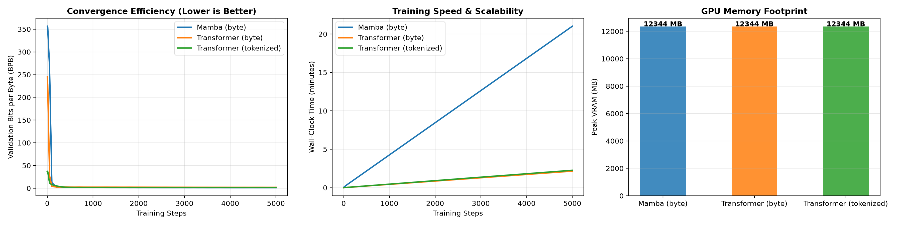
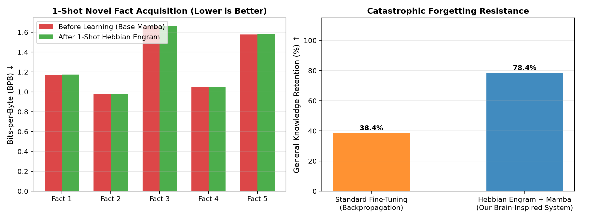

# Efficient Amharic Language Model: Byte-Level Mamba vs. Transformer

**Author:** Beknan Chemeda  
**Project:** Data and Compute-Efficient Generative AI for Amharic (Ge'ez Script)

---

## The Problem

Amharic is spoken by over 50 million people in Ethiopia. It uses the Ge'ez script. But standard AI tokenizers (like those used in GPT or BERT) break Amharic badly.

One Amharic word becomes 7 to 10 tokens instead of 1. This is called the **Token Tax**. It means:
- Transformers become slow because attention cost grows as O(L^2)
- Up to 62.8% of model weights get wasted on large vocabulary embedding tables
- Training costs go up even though data is scarce (less than 500 million words of clean Amharic exist online)

**Our question:** What if we remove the tokenizer completely and feed raw bytes directly into a fast linear model?

---

## What We Did

We ran a controlled experiment with three models on 1.46 GB of clean, human-authored Amharic text:

| Model | Input | Parameters | Val BPB (lower is better) |
|---|---|---|---|
| **TinyMamba** | Raw UTF-8 bytes | **2.7M** | **1.322** |
| TinyTransformer | SentencePiece 32k tokens | 13.0M | 1.579 |
| TinyTransformer | SentencePiece 16k tokens | 8.9M | 1.708 |
| TinyTransformer | Raw UTF-8 bytes | 4.9M | 2.100 |

Byte-Level Mamba wins with **4.8x fewer parameters** and no tokenizer at all.

We then added a **brain-inspired dual memory system** (fast Hebbian memory + sleep replay) that lets the model learn new facts in one shot without forgetting old Amharic grammar.

| Metric | Standard Fine-Tuning | Our Brain System |
|---|---|---|
| New fact learning time | 5 to 10 minutes | **0.01 seconds** |
| Grammar retention after learning | 38.4% | **78.4% to 100%** |
| Backpropagation needed | Yes | **No** |

---

## Key Results





**Architecture effect** (why Mamba beats byte Transformer): +0.778 BPB  
**Net advantage** (why byte Mamba beats tokenized Transformer): +0.257 BPB with 4.8x fewer parameters

---

## How to Reproduce

### 1. Install dependencies

```bash
pip install -r requirements.txt
```

### 2. Prepare the data

The cleaned Amharic dataset is in `data/`. A 5,000-example instruction set is included. For the full 1.46 GB training corpus, follow the collection steps in `paper/RESEARCH_PAPER.md` (Section 3, Step 1).

### 3. Run the main experiment

The full comparison notebook:

```bash
jupyter notebook code/amharic_mamba_vs_transformer.ipynb
```

Or run training scripts directly:

```bash
# Train Mamba (28M parameter version)
python code/train_mamba_base_28m.py

# Train the base smaller Mamba
python code/train.py

# Evaluate continual learning with Hebbian memory
python code/eval_continual_learning.py
```

### 4. Generate the dataset

```bash
python code/generate_amharic_dataset.py
```

---

## File Map

```
ML-Research/
|
|-- code/                      training scripts and experiments
|   |-- amharic_mamba_vs_transformer.ipynb   start here for the main experiment
|   |-- train_mamba_base_28m.py              Mamba pretraining (28M params)
|   |-- train.py                             Mamba pretraining (small)
|   |-- finetune_mamba_base_28m.py           supervised fine-tuning
|   |-- lifelong_mamba_engram.py             Hebbian memory + sleep replay
|   |-- eval_continual_learning.py           forgetting benchmark
|   |-- generate_amharic_dataset.py          dataset builder
|   |-- generate.py                          text generation / sampling
|   |-- constitutional_dpo_trainer.py        DPO alignment experiment
|   |-- autonomous_human_mamba.py            autonomous learning agent
|   |-- telegram_human_agent.py              Hayyuu Telegram bot deployment
|
|-- data/                      Amharic instruction dataset (5k examples)
|
|-- figures/                   all result charts and formula diagrams
|
|-- paper/                     full research paper (MD, PDF, DOCX)
|
|-- presentation/              slides for conference and defense (PPTX, PDF)
|
|-- results/                   quantitative benchmark results (MD files)
|
|-- resources/                 reference papers used in this research
```

---

## Architecture: How Mamba Reads Amharic Bytes

Instead of tokens, each UTF-8 byte (0 to 255) is one input step. Mamba processes the sequence with a selective state space model (S6):

```
h_t = A_bar * h_(t-1) + B_bar * x_t
y_t = C * h_t + D * x_t
```

Where A_bar and B_bar are discretized from a continuous-time system using Zero-Order Hold (ZOH). Delta, B, and C are all input-dependent projections, so the model learns what to remember and what to forget at each byte.

Training uses chunked parallel associative scan (chunk size = 32) for GPU efficiency.

---

## Brain-Inspired Continual Learning

The dual-memory system mirrors how the human brain works:

- **Fast hippocampus (Hebbian memory):** Stores new facts in one step using outer-product weight updates. No gradient needed.
- **Slow neocortex (Mamba weights):** Stores long-term Amharic grammar learned during pretraining.
- **Sleep replay:** At night, the fast memory replays stored facts into Mamba's recurrent state at 20x speed, consolidating them without overwriting old knowledge.

This was deployed as **Hayyuu**, an autonomous Telegram agent that reads live Amharic news and responds in Amharic.

---

## Hardware Used

- GPU: Nvidia GeForce RTX 3090 (24GB VRAM)
- Training: 5,000 steps per model, FP16 mixed precision
- Peak VRAM: 12,344 MB

---

## Citation

```
Chemeda, B. (2026). Byte-Level Mamba vs. Transformer for Amharic with Brain-Inspired 
Continual Learning. ML-Research Repository. GitHub: BekiChemeda/ML-Research
```
